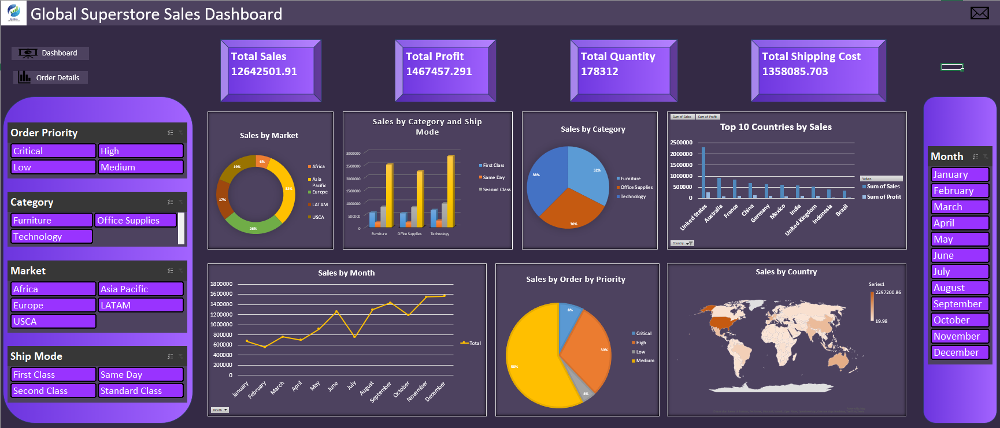

# Global-Superstore-Sales-Analysis
This project involved a comprehensive Sales Data Analytics initiative for Global Superstore, leveraging Excel for advanced reporting: data was preprocessed using Power Query for ETL, summarized via PivotTables, and visualized in an interactive Dashboard with Slicers, revealing actionable insights on performance trends and opportunities. 

 
